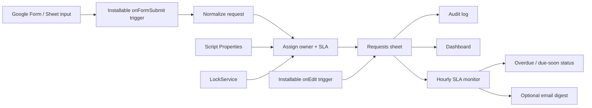

# Architecture

```mermaid
flowchart LR
    A[Google Form / Sheet input] --> B[Installable onFormSubmit trigger]
    B --> C[Normalize request]
    C --> D[Assign owner + SLA]
    D --> E[Requests sheet]
    E --> F[Audit log]
    E --> G[Dashboard]
    E --> H[Hourly SLA monitor]
    H --> I[Overdue / due-soon status]
    H --> J[Optional email digest]
    K[Installable onEdit trigger] --> E
    L[Script Properties] --> D
    M[LockService] --> D
```

The spreadsheet is the operator-facing system, but the business rules are kept in reusable functions rather than being spread across cell formulas.
